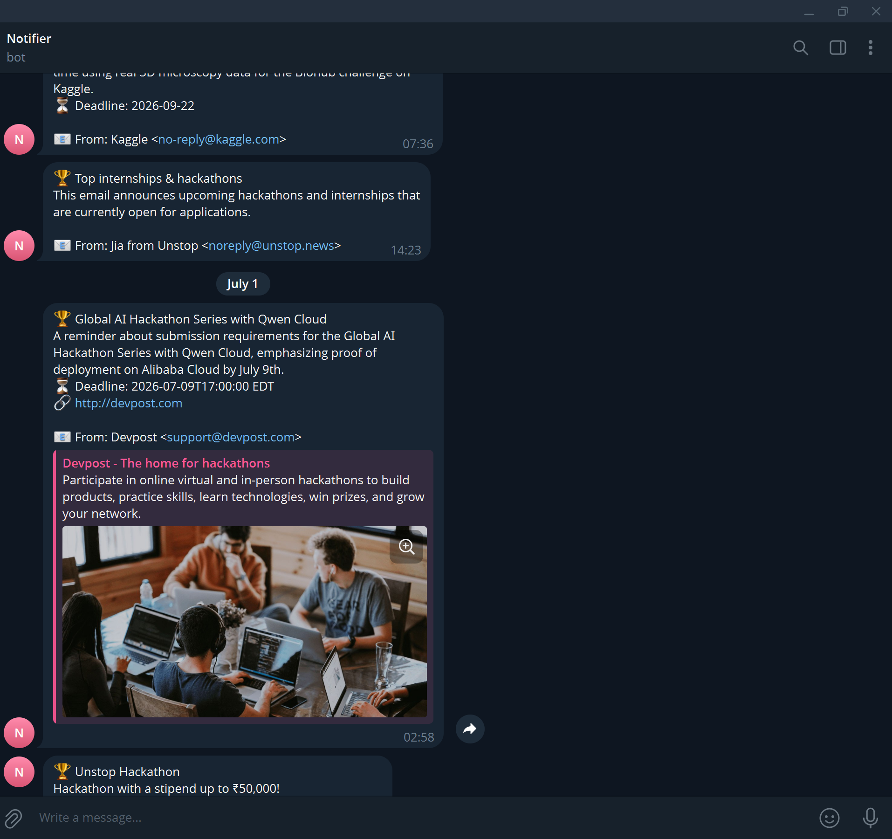

# theo_notifier — Hackathon & Deadline Notifier

> Polls Gmail every 6 hours via GitHub Actions, classifies emails with Gemini 2.5 Flash-Lite, and pushes hackathon / scholarship / deadline alerts straight to your Telegram.

---

## Why I Built This

I kept missing hackathons, scholarship deadlines, and AI-challenge announcements because they'd get buried in newsletter noise inside my inbox. Checking email manually every day doesn't scale, and existing notification apps either require paid tiers or don't understand the semantics of what I care about.

This bot fixes that: it reads my unread inbox, asks Gemini whether each email is relevant, and texts me on Telegram within 6 hours — all for free (GitHub Actions free tier + Gemini free tier + Telegram Bot API).

---
 
## Architecture

```
┌─────────────────────────────────────────────────────────────────┐
│                    GitHub Actions (cron: 0 */6 * * *)           │
└───────────────────────────┬─────────────────────────────────────┘
                            │ checkout + pip install
                            ▼
                   ┌─────────────────┐
                   │   main.py       │
                   └────┬────────────┘
                        │
          ┌─────────────▼──────────────┐
          │   Gmail API (OAuth 2.0)    │  ← token.pickle injected
          │   Fetch up to 25 unread    │    from GitHub Secret
          └─────────────┬──────────────┘
                        │  (subject + body + sender)
          ┌─────────────▼──────────────────────────────┐
          │   Gemini 2.5 Flash-Lite classifier          │
          │   → fallback: Gemini 2.5 Flash              │
          │   → retry × 3 on 503 UNAVAILABLE            │
          │   Returns structured JSON                   │
          └─────────────┬──────────────────────────────┘
                        │  if is_relevant=true AND confidence∈{high,medium}
          ┌─────────────▼──────────────┐
          │   Telegram Bot API         │  ← TELEGRAM_BOT_TOKEN
          │   sendMessage to chat_id   │    injected from Secret
          └────────────────────────────┘
                        │
          ┌─────────────▼──────────────┐
          │   processed_ids.json       │  (GitHub Actions cache)
          │   dedup so emails fire     │  prevents re-notifications
          │   at most once             │
          └────────────────────────────┘
```

---

## Tech Stack

| Layer | Tool / Library | Why |
|---|---|---|
| Scheduler | GitHub Actions cron | Free, zero-infra, logs included |
| Email source | Gmail API (`google-api-python-client`) | Official, scoped OAuth |
| Auth | `google-auth-oauthlib` | Handles token refresh transparently |
| AI classifier | `google-genai` → Gemini 2.5 Flash-Lite | Fast, cheap, structured JSON output |
| Notifications | Telegram Bot API (`requests`) | Instant push, free, works on mobile |
| Secret storage | GitHub Actions Secrets | Encrypted, never logged |
| Dedup cache | GitHub Actions cache + `processed_ids.json` | Stateless between runs |
| Language | Python 3.11 | Best library support for all of the above |

---

## Setup Guide (for a complete stranger)

### Prerequisites

- A Google account (Gmail)
- A Telegram account
- A Google Cloud account (free tier is enough)
- A GitHub account
- A Gemini API key (free tier at [aistudio.google.com](https://aistudio.google.com))

---

### 1 — Fork / clone this repo

```bash
git clone https://github.com/<your-username>/theo_notifier.git
cd theo_notifier
pip install -r requirements.txt
```

---

### 2 — Create a Google Cloud OAuth app (Gmail access)

1. Go to [console.cloud.google.com](https://console.cloud.google.com) → **New Project**.
2. Enable the **Gmail API**: *APIs & Services → Library → Gmail API → Enable*.
3. Go to *APIs & Services → OAuth consent screen*:
   - User type: **External**
   - Fill in app name, support email
   - Scopes: add `gmail.readonly` and `gmail.modify`
   - Add yourself as a **Test user** (critical — see bugs section)
4. Go to *APIs & Services → Credentials → Create Credentials → OAuth client ID*:
   - Application type: **Desktop app**
   - Download the JSON → save as **`credentials.json`** in the project root.

---

### 3 — Run local auth (one-time)

```bash
python setup_auth.py
```

This opens a browser OAuth flow, saves `token.pickle`, then prints the **base64-encoded** values of both files. You will need these in step 5.

---

### 4 — Create a Telegram bot

1. Open Telegram → search **@BotFather** → `/newbot`
2. Follow the prompts. Copy the **bot token** (looks like `123456:ABC-DEF...`).
3. Start a chat with your new bot (send it `/start`).
4. Get your **chat ID**: search **@userinfobot** → `/start` → it replies with your numeric ID.

---

### 5 — Get a Gemini API key

1. Go to [aistudio.google.com/app/apikey](https://aistudio.google.com/app/apikey)
2. Click **Create API key** → copy it.

---

### 6 — Add GitHub Secrets

In your forked repo → *Settings → Secrets and variables → Actions → New repository secret*:

| Secret Name | Value |
|---|---|
| `GMAIL_CREDENTIALS` | Base64 string of `credentials.json` (printed by `setup_auth.py`) |
| `GMAIL_TOKEN_PICKLE` | Base64 string of `token.pickle` (printed by `setup_auth.py`) |
| `GEMINI_API_KEY` | Your Gemini API key |
| `TELEGRAM_BOT_TOKEN` | Your Telegram bot token |
| `TELEGRAM_CHAT_ID` | Your Telegram numeric chat ID |

> **Important:** The base64 encoding is necessary because GitHub Secrets only accept plain text, not binary files. The workflow decodes them back to files at runtime with `base64 -d`.

---

### 7 — Trigger your first run

Go to *Actions → Hackathon Notifier → Run workflow* (manual dispatch button). Watch the logs — you should see emails classified and, if any are relevant, receive a Telegram message within seconds.

The cron then takes over automatically (`0 */6 * * *` = every 6 hours UTC).

---

## Credential Safety

All sensitive files are listed in `.gitignore` and are **never committed**:

```
credentials.json    # Google OAuth client secret
token.pickle        # OAuth refresh token (binary)
processed_ids.json  # local state cache (not sensitive, just excluded)
__pycache__/
*.pyc
```

They are supplied to GitHub Actions exclusively through **encrypted Secrets**, which are never echoed in logs.

---

## What I Learned / Interesting Bugs

### OAuth "Access blocked" — forgot to add myself as a test user
Google's consent screen defaults to "Testing" mode, which only allows explicitly listed test users. Running `setup_auth.py` without adding my own email first produced a cryptic "Access blocked: this app's request is invalid" error. Fix: *OAuth consent screen → Test users → Add your Gmail*.

### `gemini-2.0-flash` was retired mid-development
The model I started with was deprecated and returned `limit: 0` quota errors with no obvious explanation. The fix was switching to the current `gemini-2.5-flash-lite` alias and adding a fallback list so the classifier degrades gracefully to `gemini-2.5-flash` rather than crashing the whole run.

### Binary files cannot be stored directly as GitHub Secrets
`token.pickle` is a Python pickle binary. GitHub Secrets are text fields. The solution was encoding both credential files to base64 with `base64.b64encode(...).decode()`, storing the string as a Secret, and decoding at runtime in the workflow with `echo "${{ secrets.GMAIL_TOKEN_PICKLE }}" | base64 -d > token.pickle`.

### Gemini returned Markdown-fenced JSON instead of raw JSON
The model sometimes wraps its response in backtick fences even when the prompt says "no markdown". The fix was stripping those fences before `json.loads()`.

### Telegram sendMessage rejects special characters in MarkdownV2 mode
Switching to `parse_mode: MarkdownV2` caused silent 400 errors whenever the email subject contained characters like `.`, `!`, `-`, or `(`. The final design avoids `parse_mode` entirely — plain text with emoji prefixes is readable enough and never causes escaping issues.

### 503 / UNAVAILABLE storms from Gemini Flash-Lite
Under heavy load the free-tier model returns HTTP 503. A naive single retry was not enough. The fix: exponential back-off (5s, 10s, 15s), up to 3 attempts per model, before falling back to the more available `gemini-2.5-flash`.

---

## What's Next

The current system is a stateless classifier — it detects opportunities but knows nothing about you. The planned evolution:

**Phase 1 — Feedback loop (near-term)**
Telegram inline buttons (Relevant / Irrelevant / Already Seen / Registered) on each notification. Feedback stored locally and used to build a simple preference profile over time.

**Phase 2 — Importance ranking**
Replace the binary `is_relevant` flag with a float importance score composed of semantic relevance, deadline urgency, historical engagement, and similarity to previously accepted opportunities.

The full vision: a system that learns what opportunities matter to you, what to ignore, and what you are likely to pursue — improving continuously through interaction.

---

## File Structure

```
theo_notifier/
├── main.py                        # Core pipeline
├── setup_auth.py                  # One-time local OAuth helper
├── requirements.txt               # Python dependencies
├── .github/
│   └── workflows/
│       └── notifier.yml          # GitHub Actions cron workflow
├── .gitignore                     # Excludes all credential files
└── README.md                      # You are here
```

---

## License

MIT — do whatever you want with it.
